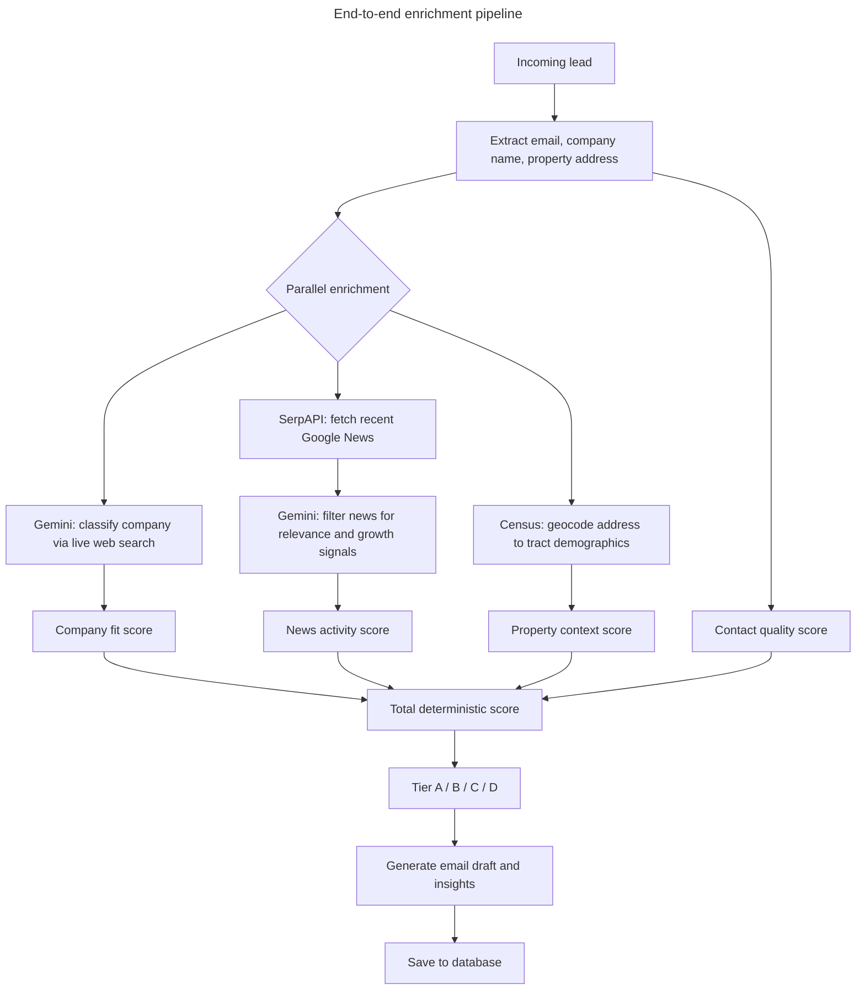
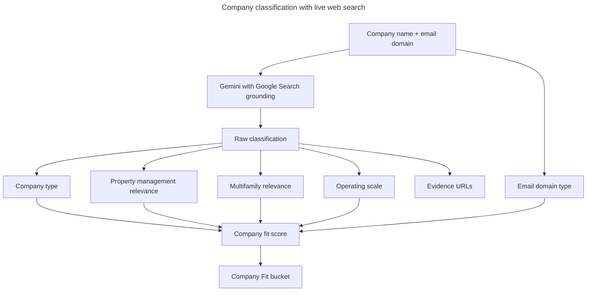
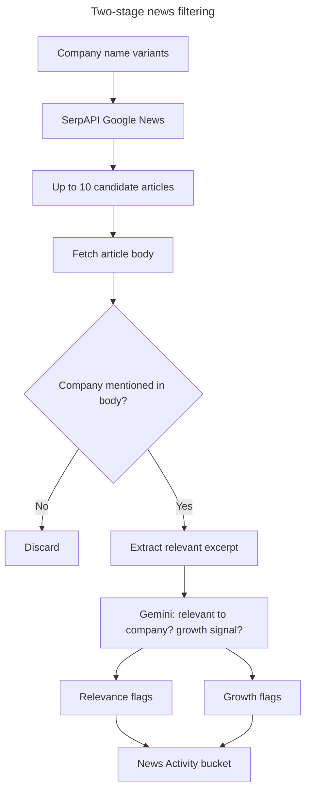
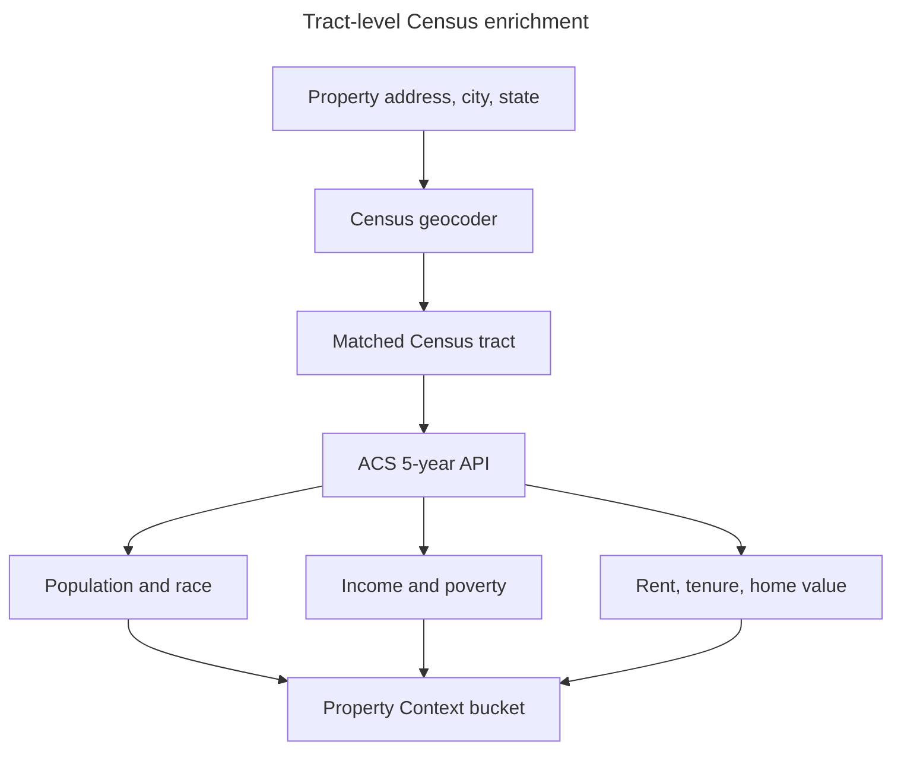
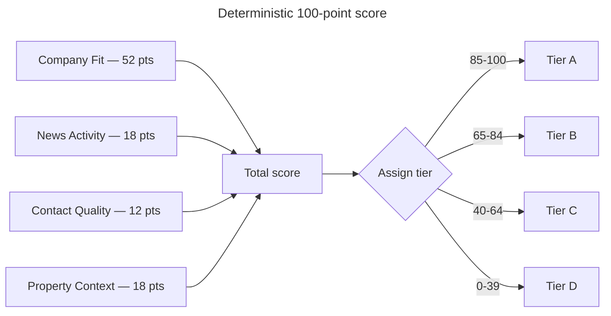
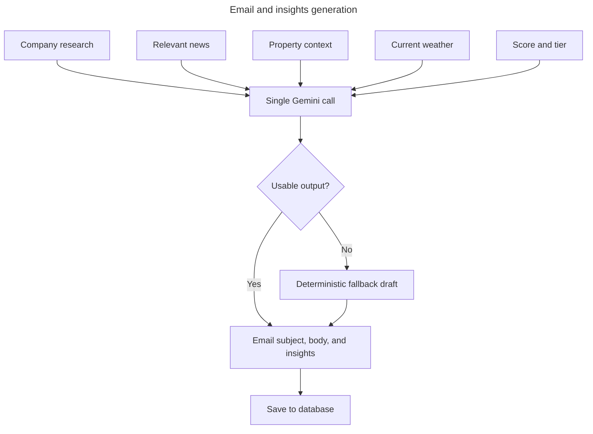

# Property Management Lead Enricher

This project takes a CRM lead, resolves what the company is, gathers company and property context, scores the lead on a deterministic 100-point model, and saves a usable outbound package: score, tier, supporting evidence, draft email, and concise insights. The goal is to turn a thin lead record into something a salesperson can review quickly without guessing what the company does or why it scored the way it did.

## App At A Glance

The lead list is the operational starting point. It shows the current book of leads, existing enrichment status, and the entry point into the enrichment flow.

## Pipeline Overview

The enrichment request starts with lead parsing, then fans out into three parallel research tracks: grounded company research, Google News retrieval, and tract-level Census enrichment. After that, the pipeline filters news for relevance and growth, computes deterministic scoring, generates the outreach package, and saves the result.

## Company Research

EliseAI sells to multifamily property managers. Before spending time on a lead, the pipeline needs to know whether the company is actually in that business — or whether it's a broker, vendor, single-building LLC, or something entirely unrelated. Gemini searches the web in real time and classifies the company by type, property-management relevance, multifamily focus, and operating scale. That classification drives 52 of the 100 points, making it the most influential signal in the model. Without grounded research you'd be guessing company identity from a name and an email address.

## News Handling

Recent company news is the strongest signal that a property manager is actively growing and under operational pressure — exactly when they're most likely to be evaluating new software. An acquisition announcement, a new development breaking ground, or an expansion into a new market tells you the company is moving fast and probably stretched thin on leasing and maintenance follow-up. The pipeline pulls up to 10 articles, verifies each one actually mentions the company by name, and then uses Gemini to judge whether the coverage reflects growth activity versus generic housing industry news.

## Property Context

EliseAI's product creates the most value in high-volume rental environments — lots of leasing inquiries, high turnover, active maintenance queues. A property in a tract that is 80% renter-occupied with $2,400 median gross rent operates in a fundamentally different way than one in a suburban owner-occupied neighborhood. The Census enrichment pulls tract-level ACS 5-year data so the score can reward leads operating in dense, high-rent rental markets where the ROI case for leasing and maintenance AI is strongest.

## Weather

Weather does not affect scoring. It gives the email generation model a timely, location-specific opening line so the outreach feels written today rather than templated. A cold email that opens with something grounded in the current moment reads differently than one that opens with "I wanted to reach out."

## Scoring Model

The current model is a true 100-point deterministic score. No normalization step is applied after the bucket totals are computed.

| Bucket | Max Points | What It Measures |
| --- | ---: | --- |
| Company Fit | 52 | Grounded company classification: type, property-management relevance, multifamily relevance, scale, email-domain signal, confidence adjustment |
| News Activity | 18 | At least 3 relevant articles out of 10, or 30% if fewer than 10; plus growth-language signals |
| Contact Quality | 12 | Whether the contact uses a corporate email domain instead of a free inbox |
| Property Context | 18 | Tract renter share > 40%, local population > 4k, median gross rent > $1,500 |
| **Total** | **100** | Sum of the four deterministic buckets |

Tier thresholds:

- `A`: 85-100
- `B`: 65-84
- `C`: 40-64
- `D`: 0-39

## Output Generation

A salesperson shouldn't have to write a cold email from scratch after reviewing enrichment. Once the score is computed, the pipeline feeds all resolved context into a single Gemini call and gets back a subject line, email body, and 4–6 insight bullets. The prompt instructs Gemini to tailor the pitch based on company type, size, growth signals, and local market density. If that call fails, a deterministic fallback assembles a plain-text draft from the enriched fields directly. Either way, the result is always saved.

The enrichment detail view is where the resolved company research, score breakdown, property context, and outreach draft come together for review.

## External APIs

| API | Where to get a key | What it adds |
| --- | --- | --- |
| Gemini (Google Search grounding) | [Google AI Studio](https://aistudio.google.com/app/apikey) | Live company research: type, scale, PM/multifamily relevance, evidence URLs |
| SerpAPI (Google News) | [serpapi.com](https://serpapi.com/manage-api-key) | Candidate article discovery for company news |
| U.S. Census Geocoder + ACS 5-year | [api.census.gov](https://api.census.gov/data/key_signup.html) | Address-based tract enrichment with demographic, economic, and housing context |
| OpenWeather | [openweathermap.org](https://home.openweathermap.org/api_keys) | Current local weather for outreach context |

## Run Locally

1. Install backend dependencies and configure environment variables:
   `GEMINI_API_KEY` (or `GOOGLE_API_KEY`), `SERPAPI_API_KEY`, `OPENWEATHER_API_KEY`, optional `CENSUS_API_KEY`.
2. Seed sample test leads:
   `python manage.py seed_test_leads`
3. Start the Django API:
   `python manage.py runserver 8001`
4. Enrich one lead through the UI or API:
   `POST /api/enrich/<lead_id>/`
5. Batch-enrich every lead without a result:
   `python manage.py enrich_all_leads`

## Known Limitations

- Company research can still fall back to `unknown` when Gemini grounding or response parsing fails, though those failures are now surfaced in `raw_enrichment._errors`.
- News quality is only as good as the Google News search results and article body accessibility; some publishers return `403`.
- Property context is U.S.-only; non-U.S. addresses return `status: skipped`.
- Census tract geography is statistically useful but not always human-friendly; the frontend presents it as "Property context" rather than exposing raw tract jargon everywhere.
