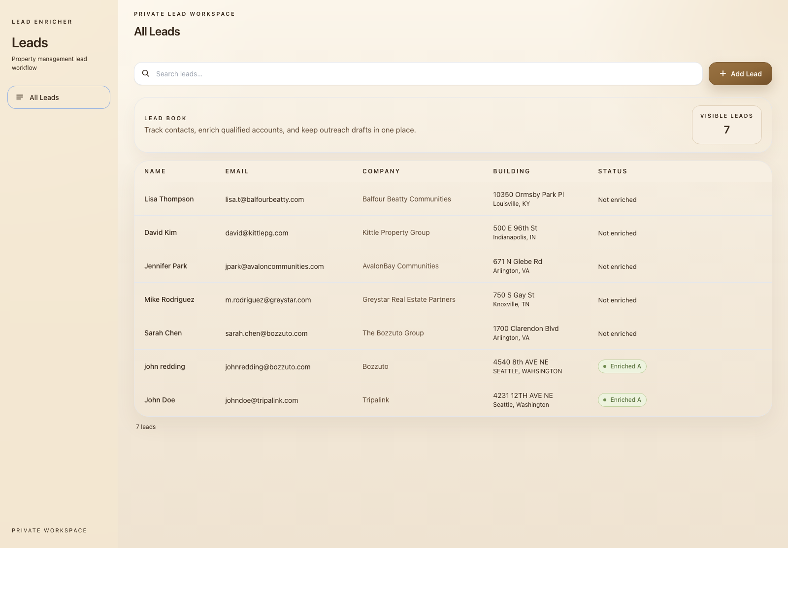
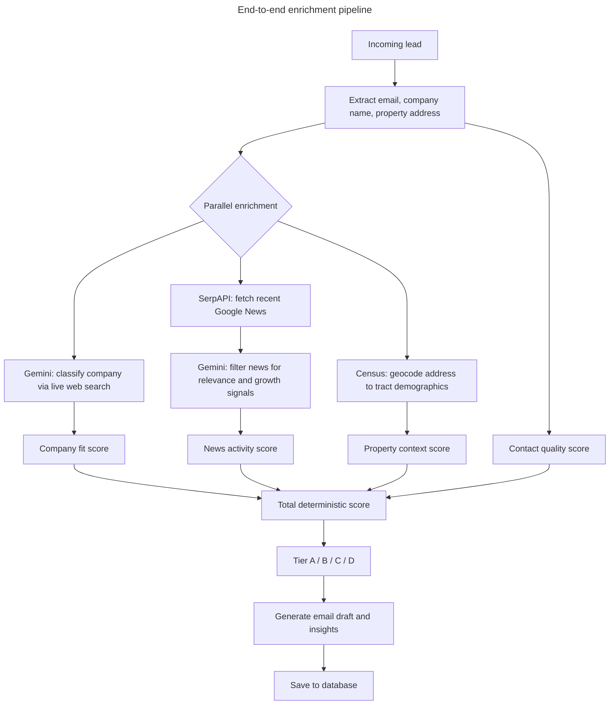
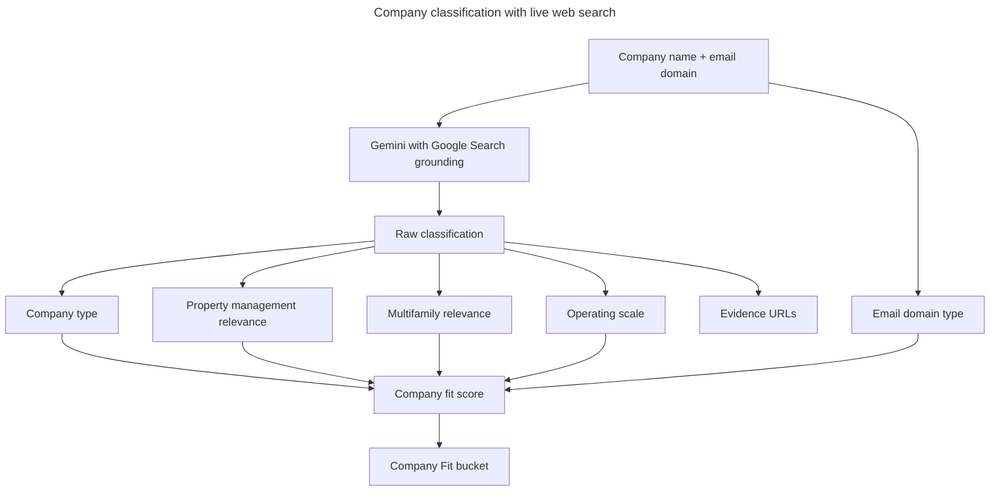
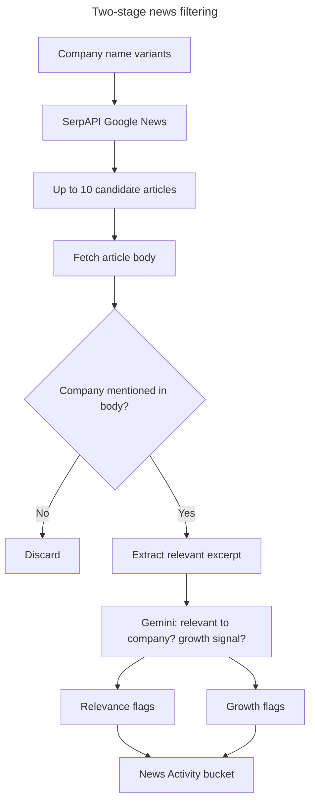
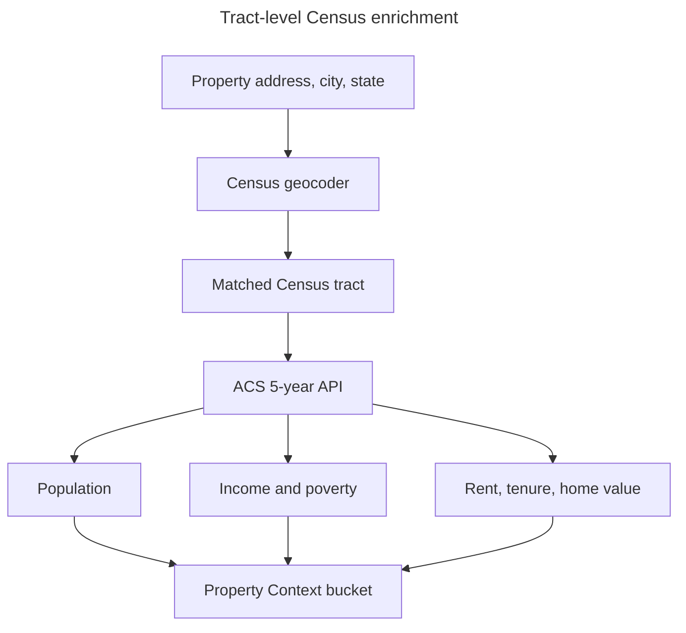
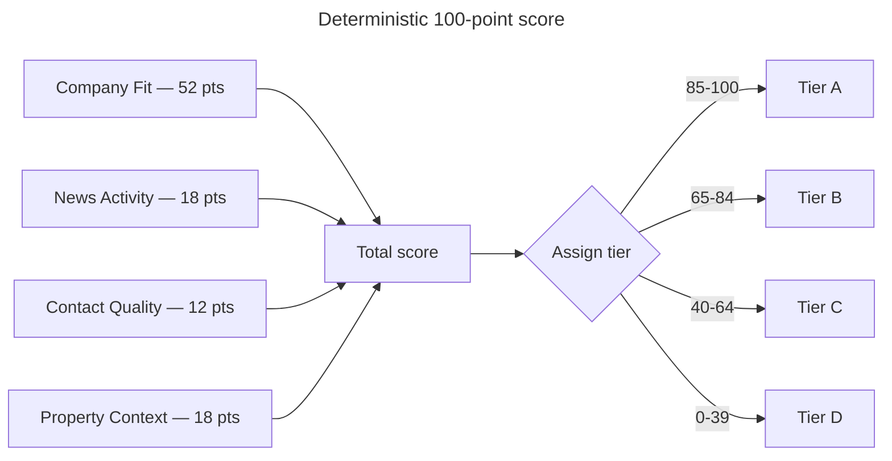
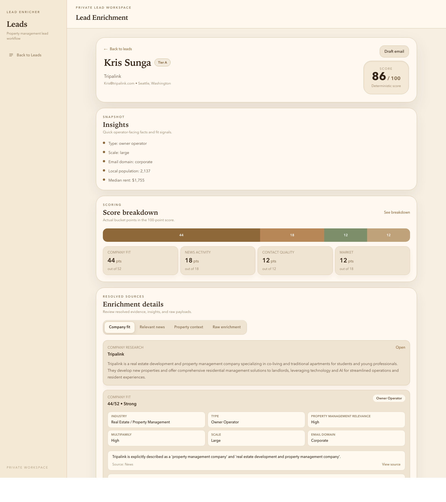
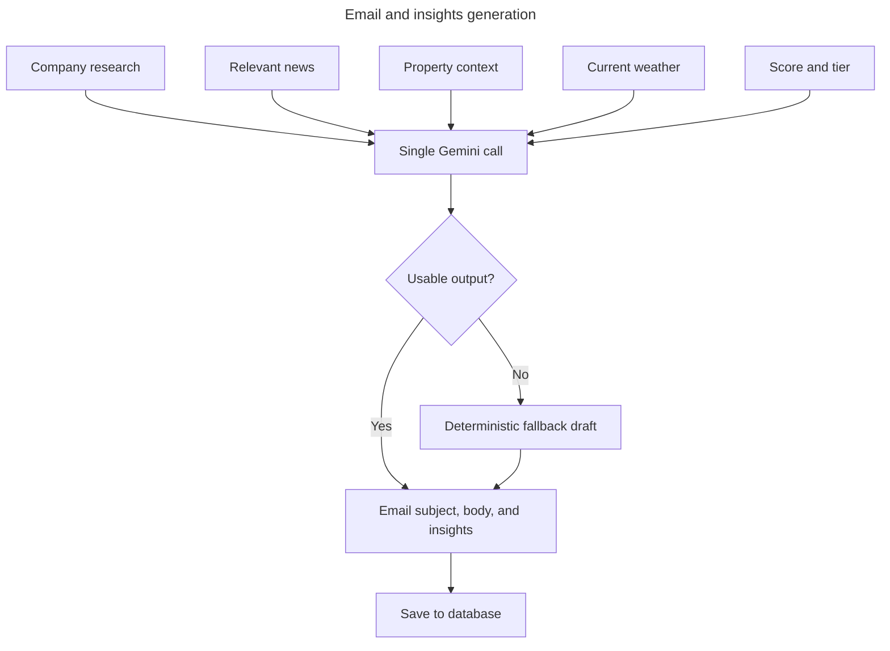
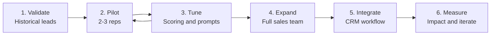

# Property Management Lead Enricher for EliseAI

This project takes a CRM lead, resolves what the company is, gathers company and property context, scores the lead on a deterministic 100-point model, and saves a usable outbound package: score, tier, supporting evidence, draft email, and concise insights. The goal is to turn a thin lead record into something a salesperson can review quickly without guessing what the company does or why it scored the way it did.

## App At A Glance

The lead list is the operational starting point. It shows the current book of leads, existing enrichment status, and the entry point into the enrichment flow.

## Pipeline Overview

The enrichment request starts with lead parsing, then fans out into three parallel research tracks: grounded company research, Google News retrieval, and tract-level Census enrichment. After that, the pipeline filters news for relevance and growth, computes deterministic scoring, generates the outreach package, and saves the result.

## Company Research

EliseAI sells to multifamily property managers. Before spending time on a lead, the pipeline needs to know whether the company is actually in that business — or whether it's a broker, vendor, single-building LLC, or something entirely unrelated. Gemini searches the web in real time and classifies the company by type, property-management relevance, multifamily focus, and operating scale. That classification drives 52 of the 100 points, making it the most influential signal in the model. Without grounded research you'd be guessing company identity from a name and an email address.

## News Handling

Recent company news is the strongest signal that a property manager is actively growing and under operational pressure — exactly when they're most likely to be evaluating new software. An acquisition announcement, a new development breaking ground, or an expansion into a new market tells you the company is moving fast and probably stretched thin on leasing and maintenance follow-up. The pipeline pulls up to 10 articles, verifies each one actually mentions the company by name, and then uses Gemini to judge whether the coverage reflects growth activity versus generic housing industry news.

## Property Context

EliseAI's product creates the most value in high-volume rental environments — lots of leasing inquiries, high turnover, active maintenance queues. A property in a tract that is 80% renter-occupied with $2,400 median gross rent operates in a fundamentally different way than one in a suburban owner-occupied neighborhood. The Census enrichment pulls tract-level ACS 5-year data so the score can reward leads operating in dense, high-rent rental markets where the ROI case for leasing and maintenance AI is strongest.

## Scoring Model

The current model is a true 100-point deterministic score. No normalization step is applied after the bucket totals are computed.

| Bucket | Max Points | What It Measures |
| --- | ---: | --- |
| Company Fit | 52 | Grounded company classification: type, PM relevance, multifamily relevance, scale, confidence adjustment |
| News Activity | 18 | Recent relevant company coverage and growth signals |
| Contact Quality | 12 | Whether the contact uses a corporate email domain |
| Property Context | 18 | Tract renter share, population, and median rent thresholds |
| **Total** | **100** | Sum of the four deterministic buckets |

Tier thresholds:

- `A`: 85–100
- `B`: 65–84
- `C`: 40–64
- `D`: 0–39

### Company Fit (max 52)

The largest bucket. Gemini classifies the company via live web search, and the result is converted into a deterministic score. The whole bucket is then multiplied by Gemini's confidence value (0.0–1.0) — if it found solid evidence the score passes through at full value; if it's guessing from thin information the score is discounted proportionally.

**Company type** is the dominant signal, worth up to 38 points:

| Type | Points | Reasoning |
| --- | ---: | --- |
| Large property manager | 38 | Ideal customer — high leasing volume, maintenance load, resident communication at scale |
| Owner-operator | 30 | Manages their own properties; same operational problems, slightly smaller scale |
| Small property manager | 27 | Right business, smaller footprint |
| Property-specific entity | 18 | Single building LLC or similar — possible fit but limited scale |
| Broker | 9 | Adjacent to property management but unlikely to be a direct buyer |
| Vendor | 6 | Serves property managers but is not one |
| Unknown | 6 | Could still be relevant — conservative non-zero rather than a hard zero |
| Unrelated | 0 | Not in the industry |

**Property management relevance bonus** (up to 8 pts) — how directly and primarily the company operates in property management. A company that manages 10,000 units scores high; one that manages a single building on the side scores low.

**Multifamily relevance bonus** (up to 3 pts) — EliseAI is a multifamily product. Companies focused on single-family rentals or commercial real estate are a weaker fit even if they are property managers.

**Scale signal bonus** (up to 3 pts) — larger operators have more leasing volume, maintenance tickets, and resident communication, giving EliseAI more surface area to help. Small operators have less operational pressure so the ROI case is weaker.

### News Activity (max 18)

**Recent relevant news (8 pts)** — fires if at least 30% of fetched articles (minimum 3 out of 10) actually mention the company by name. The threshold filters out generic real estate industry coverage that SerpAPI returns for any company in a busy market.

**Growth signal (10 pts)** — fires only if relevant news exists and Gemini judged at least one article as containing a growth signal: acquisition, new development, expansion, or funding. A growing company is under operational pressure and actively evaluating new tools. Growth signal cannot fire without relevant news passing first.

### Contact Quality (max 12)

A single binary rule: does the contact use a corporate email domain rather than a free inbox (Gmail, Outlook, Yahoo, etc.)? A corporate email means the person is reachable through their company and the company identity is confirmed by the domain. Free inbox contacts are harder to verify and less likely to be the right decision-maker. Worth 12 points if corporate, 0 otherwise.

### Property Context (max 18)

Three binary rules worth 6 points each, all drawn from Census ACS 5-year tract-level data:

- **Renter share > 40%** — EliseAI is built for rental operations. A mostly renter-occupied tract means real leasing volume, turnover, and maintenance traffic.
- **Population > 4,000** — Very sparse tracts signal rural or low-density areas where operational volume is low and the ROI case for automation is weak.
- **Median gross rent > $1,500** — Higher-rent markets are more competitive, with more prospect inquiries per unit and more pressure to respond fast.

## Output Generation

A salesperson shouldn't have to write a cold email from scratch after reviewing enrichment. Once the score is computed, the pipeline feeds all resolved context into a single Gemini call and gets back a subject line, email body, and 4–6 insight bullets. The prompt instructs Gemini to tailor the pitch based on company type, size, growth signals, and local market density. If that call fails, a deterministic fallback assembles a plain-text draft from the enriched fields directly. Either way, the result is always saved.

The enrichment detail view is where the resolved company research, score breakdown, property context, and outreach draft come together for review.

## Insights

Each enrichment result includes five insight bullets shown at the top of the detail view. They are derived deterministically from the enrichment data — no LLM involved — so they are always present even when the email generation falls back.

The five bullets and why these specifically:

- **Type** — the single most important fact. Before reaching out, a salesperson needs to know whether this is a property manager, a broker, a vendor, or something unrelated. It anchors everything else in the review.
- **Scale** — tells you the size of the conversation to expect. Large means a complex multi-property operation with budget authority. Small means you're probably talking to an owner who does everything themselves.
- **Email domain** — a quick legitimacy signal. A corporate domain confirms the contact is reachable through their company and the company identity is verified. A free inbox (Gmail, Outlook, etc.) means more uncertainty about who you're actually dealing with.
- **Local population** — market density context. A salesperson pitching into a dense urban market should frame the conversation differently than one pitching into a rural area.
- **Median rent** — market quality signal. High rent means competitive leasing, high inquiry volume, and pressure to respond fast — the core ROI case for EliseAI.

Together they give a salesperson the five-second read on a lead: what is this company, how big are they, is the contact legitimate, and what market pressure are they under.

## External APIs

| API | Where to get a key | What it adds |
| --- | --- | --- |
| Gemini (Google Search grounding) | [Google AI Studio](https://aistudio.google.com/app/apikey) | Live company research: type, scale, PM/multifamily relevance, evidence URLs |
| SerpAPI (Google News) | [serpapi.com](https://serpapi.com/manage-api-key) | Candidate article discovery for company news |
| U.S. Census Geocoder + ACS 5-year | [api.census.gov](https://api.census.gov/data/key_signup.html) | Address-based tract enrichment with demographic, economic, and housing context |

## Run Locally

1. Install backend dependencies and configure environment variables:
   `GEMINI_API_KEY` (or `GOOGLE_API_KEY`), `SERPAPI_API_KEY`, `OPENWEATHER_API_KEY`, optional `CENSUS_API_KEY`.
2. Seed sample test leads:
   `python manage.py seed_test_leads`
3. Start the Django API:
   `python manage.py runserver 8001`
4. Enrich one lead through the UI or API:
   `POST /api/enrich/<lead_id>/`
5. Batch-enrich every lead without a result:
   `python manage.py enrich_all_leads`

## Sales Org Rollout Plan

The rollout should be phased: validate the scoring on historical outcomes first, test it with a small rep group, tune the weak spots, then widen access and connect it more deeply into CRM workflows.

### Phase 1 — Internal Validation (Weeks 1–2)

Before any rep touches it, validate the scoring against reality. Pull 50–100 closed-won and closed-lost deals from the CRM, run them through the enrichment pipeline, and check whether the scores align with outcomes — did the A-tiers convert? Did the D-tiers go dark? This tells you whether the model is calibrated before reps form opinions based on bad scores. Also flag systematic failures: companies where Gemini returns unknown, addresses Census can't geocode, leads with no news coverage.

**Deliverable:** a spreadsheet of historical leads with enrichment scores vs actual outcomes, plus a short writeup of where the model is confident and where it isn't.

### Phase 2 — Pilot with 2–3 Reps (Weeks 3–6)

Pick one SDR and one AE — detail-oriented people who will give honest feedback. Give them the tool alongside their normal workflow without replacing anything yet. Ask them to enrich every new lead before outreach, use the draft email as a starting point, and log whether the score felt right after they learned more about the company. Weekly 30-minute syncs. You're listening for: does the score match their gut after a call? Are the insights surfacing things they didn't know? Is the email draft saving time or creating more editing work?

**Stakeholders:** Head of Sales for pilot sign-off, CRM owner to avoid data hygiene problems.

### Phase 3 — Scoring Calibration (Weeks 5–7)

Based on pilot feedback, adjust the model. Common things that need tuning at this stage: tier thresholds if reps say B-tier leads are actually converting well, company type weights if a certain type keeps surprising reps, and property context thresholds if the rent floor or renter share cutoffs don't match the markets EliseAI is targeting. Also assess email generation quality — are reps sending the draft mostly as-is, editing heavily, or ignoring it entirely?

**Stakeholders:** RevOps for conversion data, Marketing for ICP alignment.

### Phase 4 — Full Team Rollout (Month 2)

Once pilot reps are using it consistently and scores feel right, roll out to the full SDR and AE team. Codify three process changes: enrichment is required before a lead enters a sequence; tier gates which sequence the lead enters (A-tier high-touch, D-tier lighter cadence or deprioritized); draft email is the starting point, not optional. Run a single 45-minute training session walking through what the score means, what the insights represent, and how to read the evidence panel.

**Stakeholders:** Sales Ops to update the playbook, Head of Sales to communicate the process change.

### Phase 5 — CRM Integration (Month 2–3)

Enrichment data needs to live in the CRM to be durable. Start with a webhook that pushes score, tier, and key fields when an enrichment is created — this keeps the enrichment tool as the source of truth while making data visible to anyone in the CRM without opening a separate UI. Longer term, trigger enrichment automatically when a new lead is created.

**Stakeholders:** Sales Ops or RevOps for CRM field setup, Engineering for the integration.

### Phase 6 — Measuring Impact (Month 3+)

Metrics to track: reply rate by tier, time to first outreach, email edit rate, and pipeline from enriched vs unenriched leads. Set a 60-day checkpoint. The key is to measure the tool against the old workflow, not in isolation.

**How to measure it well:**

- **Reply rate by tier** — Compare A, B, C, and D-tier reply rates over the same time window. The question is whether the score is actually separating stronger leads from weaker ones. If A-tier and D-tier leads perform the same, the model is not creating useful signal.
- **Time to first outreach** — Measure the time from lead creation to first outbound touch before and after rollout. If reps are enriching leads but not moving faster, the workflow may be adding friction instead of removing it.
- **Email edit rate** — Track whether reps send the draft mostly as-is, make light edits, or rewrite it completely. A high rewrite rate means the drafting step is not earning trust yet, even if the rest of the enrichment is useful.
- **Pipeline creation from enriched vs unenriched leads** — Compare how often enriched leads turn into real opportunities versus leads that were handled without the tool. This is the clearest test of whether the enrichment is improving prioritization rather than just producing interesting research.
- **Rep-rated usefulness** — Ask pilot users to score each enrichment quickly after use: helpful, neutral, or not useful. That gives qualitative signal on whether the UI, score, and evidence are helping real decisions.

At the 60-day checkpoint, the review should answer three simple questions: are reps moving faster, are they trusting the output, and are higher-scored leads performing better downstream? If not, the scoring model or workflow needs another iteration before broader operational dependency is added.

### Summary Timeline

| Week | Work |
|---|---|
| 1–2 | Score historical closed-won/lost deals, validate model |
| 3–6 | Pilot with 2–3 reps, weekly feedback syncs |
| 5–7 | Calibrate scoring thresholds based on pilot data |
| 8 | Full team rollout and training |
| 9–12 | CRM integration |
| 12+ | 60-day metrics review, iterate |

### Key Stakeholders

| Stakeholder | Role |
|---|---|
| Head of Sales | Sponsor — sets expectation that enrichment is required |
| Pilot reps | Primary feedback source during validation |
| Sales Ops | Process documentation, CRM field setup, playbook update |
| RevOps | Historical data pull, ongoing metrics tracking |
| Marketing | ICP alignment — ensure scoring rewards the right company types |
| Engineering | CRM webhook integration |

## Future Work

**LLM-generated research summary.** The pipeline currently surfaces raw enrichment data — company classification, news articles, Census figures — as separate panels. A useful next step would be a single Gemini call at the end of the pipeline that reads all resolved context and writes a short paragraph summarising what was found: what the company does, what market they operate in, what the recent news signal suggests, and why the score landed where it did. This would give a salesperson a coherent narrative to read in 10 seconds rather than having to piece together the panels themselves.

**Fault-tolerant pipeline with Temporal.** Gemini API calls fail under high demand — 503s, partial responses, and timeouts are real in production. The current pipeline handles failures gracefully by falling back to deterministic outputs, but it has no retry scheduling, no visibility into which steps failed across a batch of leads, and no way to resume a partially completed enrichment. Replacing the async pipeline with [Temporal](https://temporal.io) workflows would give each enrichment step its own retry policy, automatic backoff, and a full audit trail of what ran and what didn't. It would also make it straightforward to re-run only the failed steps on a lead without re-running the whole pipeline.

**Scoring rebalance based on testing.** The current point values and thresholds were set based on first principles, not outcome data. Once the pipeline has been used on a meaningful volume of leads and some have progressed through the sales cycle, the weights should be revisited. If A-tier leads are not converting at a higher rate than B-tier, the tier thresholds or bucket weights need adjustment. The company type base scores in particular — the gap between large property manager (38) and owner-operator (30) — should be validated against what actually closes.

## Known Limitations

- Company research can still fall back to `unknown` when Gemini grounding or response parsing fails, though those failures are now surfaced in `raw_enrichment._errors`.
- News quality is only as good as the Google News search results and article body accessibility; some publishers return `403`.
- Property context is U.S.-only; non-U.S. addresses return `status: skipped`.
- Census tract geography is statistically useful but not always human-friendly; the frontend presents it as "Property context" rather than exposing raw tract jargon everywhere.
