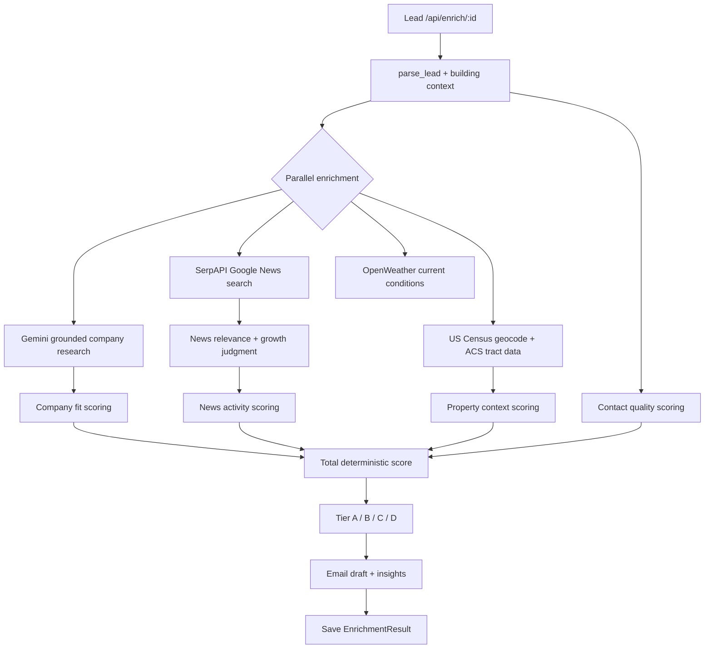
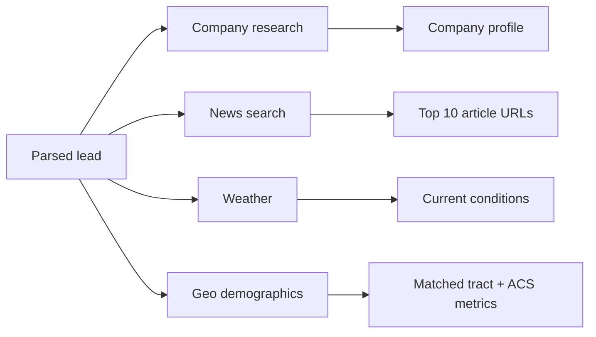
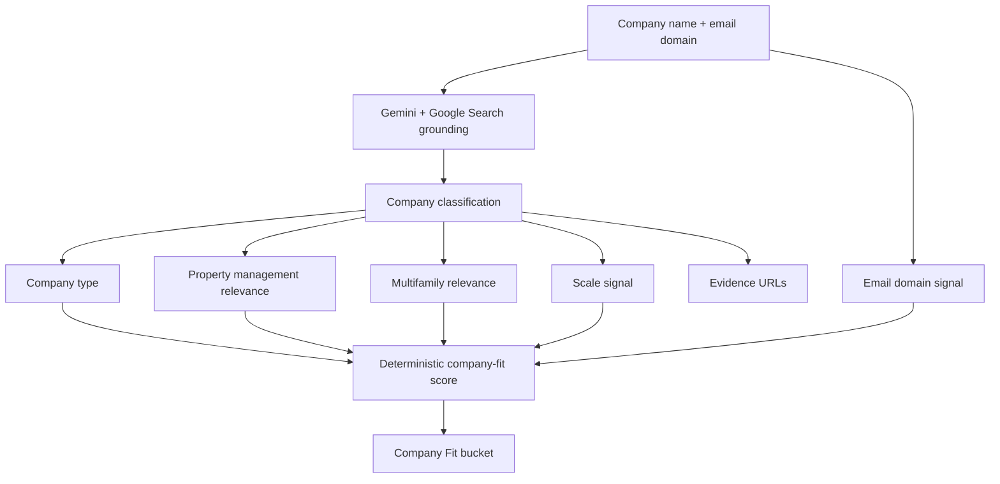
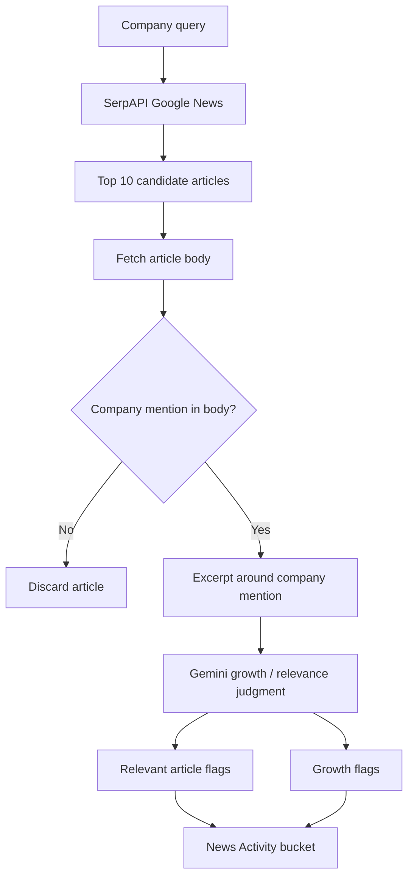
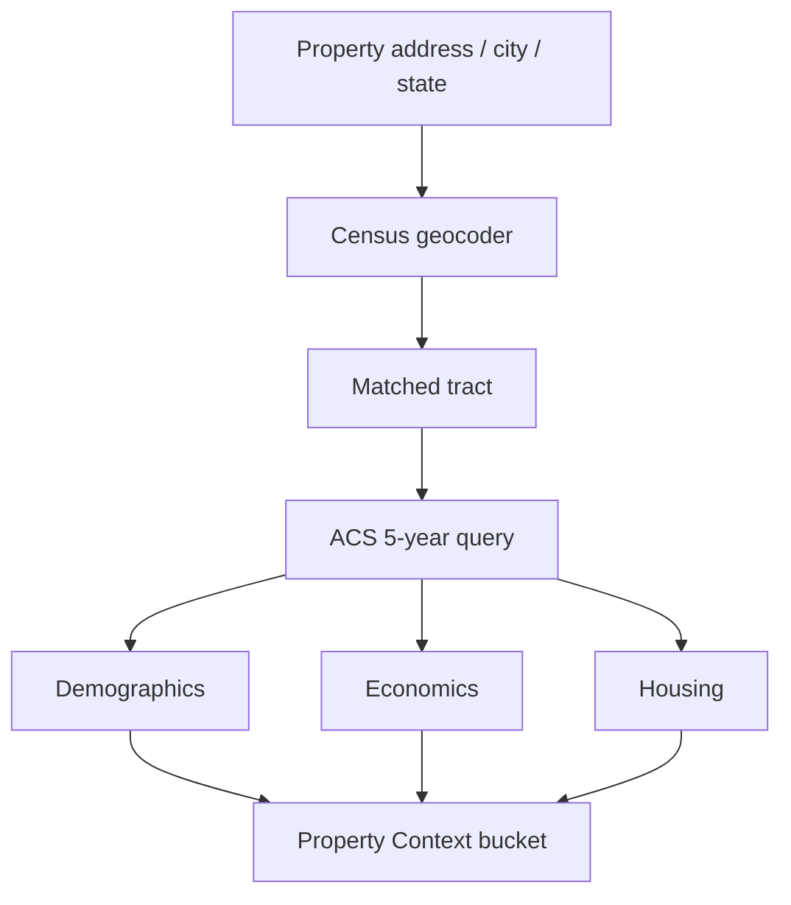
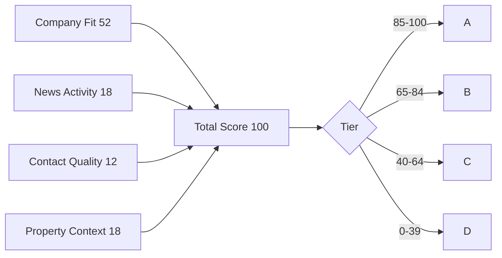
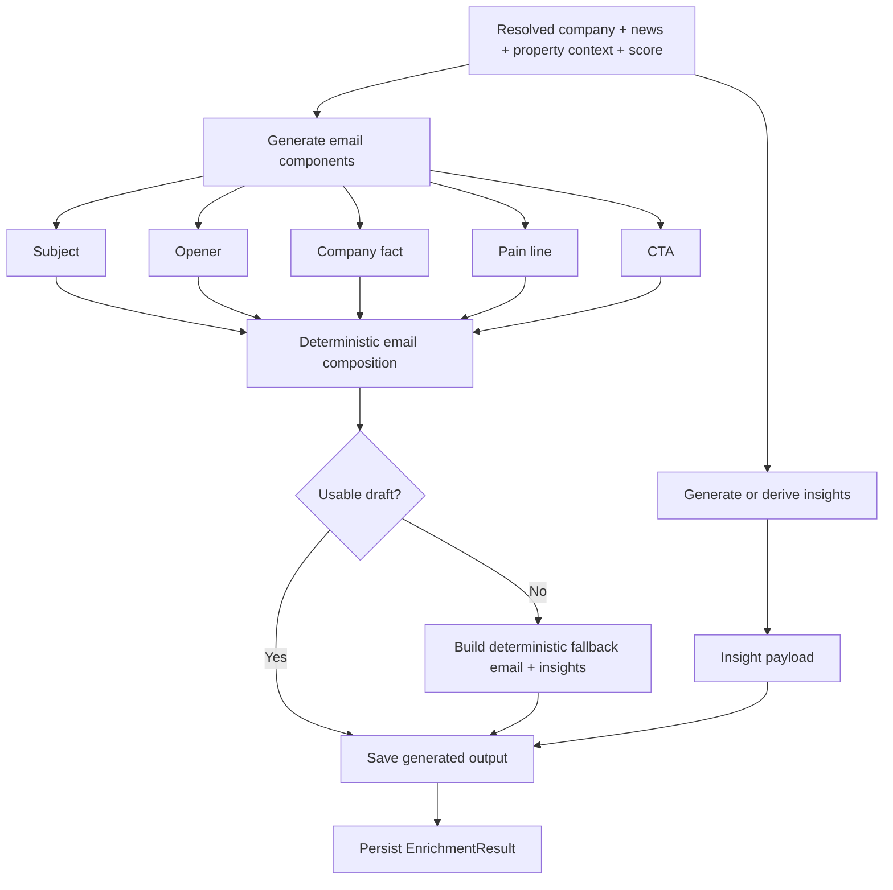
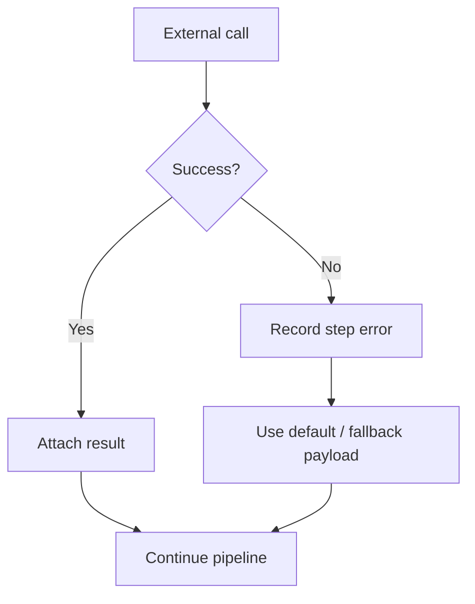

# Property Management Lead Enricher

This project takes a CRM lead, resolves what the company is, gathers company and property context, scores the lead on a deterministic 100-point model, and saves a usable outbound package: score, tier, supporting evidence, draft email, and concise insights. The goal is to turn a thin lead record into something an AE can review quickly without guessing what the company does or why it scored the way it did.

## App At A Glance

The lead list is the operational starting point. It shows the current book of leads, existing enrichment status, and the entry point into the enrichment flow.

## Pipeline Overview

The enrichment request starts with lead parsing, then fans out into four parallel research tracks: grounded company research, Google News retrieval, weather, and tract-level Census enrichment. After that, the pipeline filters news for relevance and growth, computes deterministic scoring, generates the outreach package, and saves the result.

## Parallel Research Stage

This is the highest-latency part of the pipeline, so it runs concurrently. The point is to avoid waiting for company research to finish before news, weather, or Census calls begin.

## Company Research

Company research is the classification layer. Gemini with Google Search grounding is used to determine what the company does, whether it is actually property-management related, whether it is multifamily relevant, how large it seems, and what evidence supports those claims. The code then converts that classification into score components.

## News Handling

News is intentionally two-stage. First the system finds candidate articles. Then it checks article body excerpts for actual company mentions and growth language so generic housing coverage does not inflate the score.

## Property Context

Property context is tract-level, not city-level. The address is geocoded to a Census tract, then ACS 5-year data is normalized into readable housing, demographic, and economic fields. The UI now calls this “Property context,” but the backend is still using tract-level Census geography under the hood.

## Scoring Model

The current model is a true 100-point deterministic score. No normalization step is applied after the bucket totals are computed.

| Bucket | Max Points | What It Measures |
| --- | ---: | --- |
| Company Fit | 52 | Grounded company classification: type, property-management relevance, multifamily relevance, scale, email-domain signal, confidence adjustment |
| News Activity | 18 | At least 3 relevant articles out of 10, or 30% if fewer than 10; plus growth-language signals |
| Contact Quality | 12 | Whether the contact uses a corporate email domain instead of a free inbox |
| Property Context | 18 | Tract renter share > 40%, local population > 4k, median gross rent > $1,500 |
| **Total** | **100** | Sum of the four deterministic buckets |

Tier thresholds:

- `A`: 85-100
- `B`: 65-84
- `C`: 40-64
- `D`: 0-39

## Output Generation

Once the score is computed, the pipeline generates the final user-facing package. The email path is now component-based: Gemini is asked for a subject, opener, company fact, pain line, and CTA. The code then assembles the final draft deterministically and rejects thin outputs. If Gemini still does not return usable components, the system writes a deterministic fallback email and fallback insights instead of saving blanks.

The enrichment detail view is where the resolved company research, score breakdown, property context, and outreach draft come together for review.

## External APIs

| API | What It Adds |
| --- | --- |
| Gemini (Google Search grounding) | Live company research: type, scale, PM/multifamily relevance, evidence URLs |
| SerpAPI (Google News) | Candidate article discovery for company news |
| U.S. Census Geocoder + ACS 5-year | Address-based tract enrichment with demographic, economic, and housing context |
| OpenWeather | Current local weather for outreach context |

## Run Locally

1. Install backend dependencies and configure environment variables:
   `GEMINI_API_KEY` (or `GOOGLE_API_KEY`), `SERPAPI_API_KEY`, `OPENWEATHER_API_KEY`, optional `CENSUS_API_KEY`.
2. Seed sample test leads:
   `python manage.py seed_test_leads`
3. Start the Django API:
   `python manage.py runserver 8001`
4. Enrich one lead through the UI or API:
   `POST /api/enrich/<lead_id>/`
5. Batch-enrich every lead without a result:
   `python manage.py enrich_all_leads`

## Fault Tolerance

The pipeline is designed to save partial results instead of hard-failing the entire request. If a provider errors out, the pipeline records the failure under `raw_enrichment._errors` and keeps going with whatever succeeded.

## Known Limitations

- Company research can still fall back to `unknown` when Gemini grounding or response parsing fails, though those failures are now surfaced in `raw_enrichment._errors`.
- News quality is only as good as the Google News search results and article body accessibility; some publishers return `403`.
- Property context is U.S.-only; non-U.S. addresses return `status: skipped`.
- The current email draft path is intentionally fail-soft and may use a deterministic fallback when Gemini does not return a usable draft.
- Census tract geography is statistically useful but not always human-friendly; the frontend presents it as “Property context” rather than exposing raw tract jargon everywhere.
